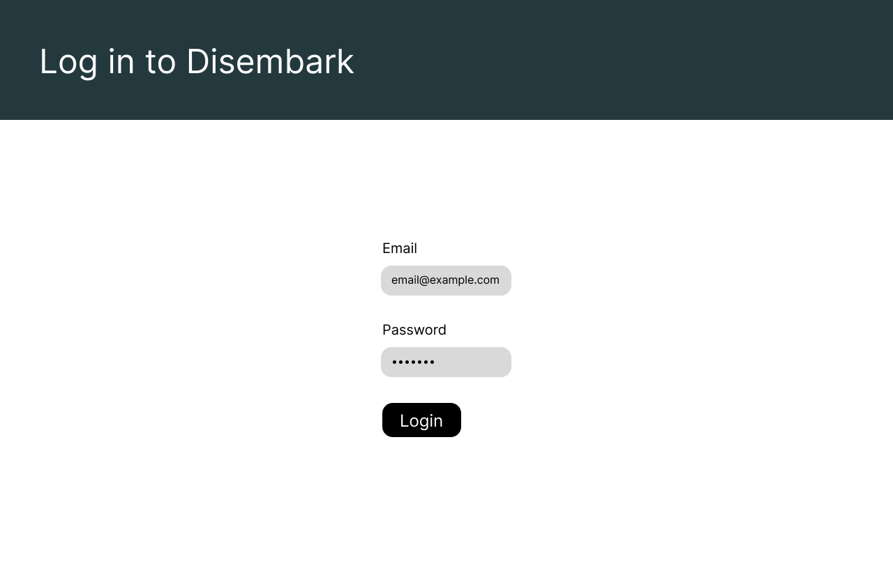
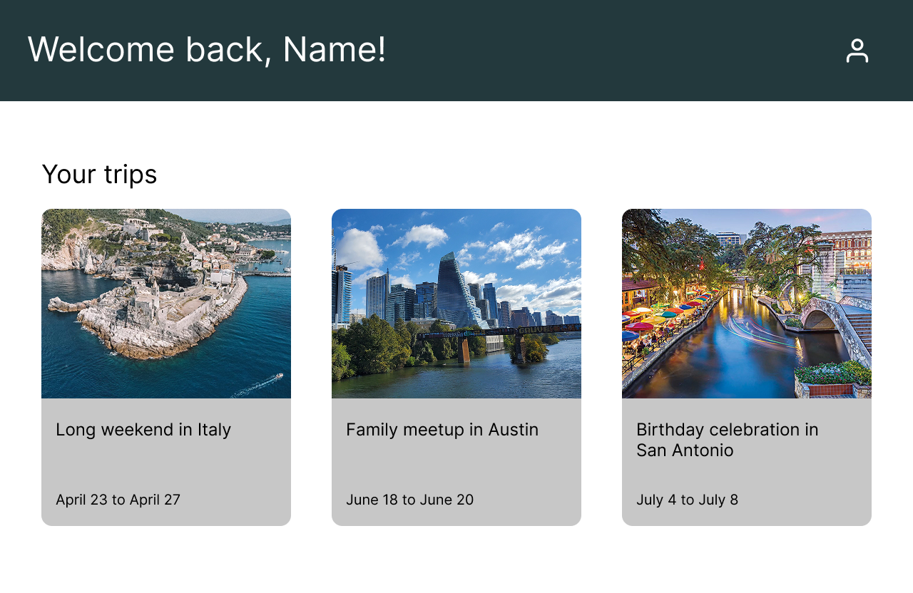
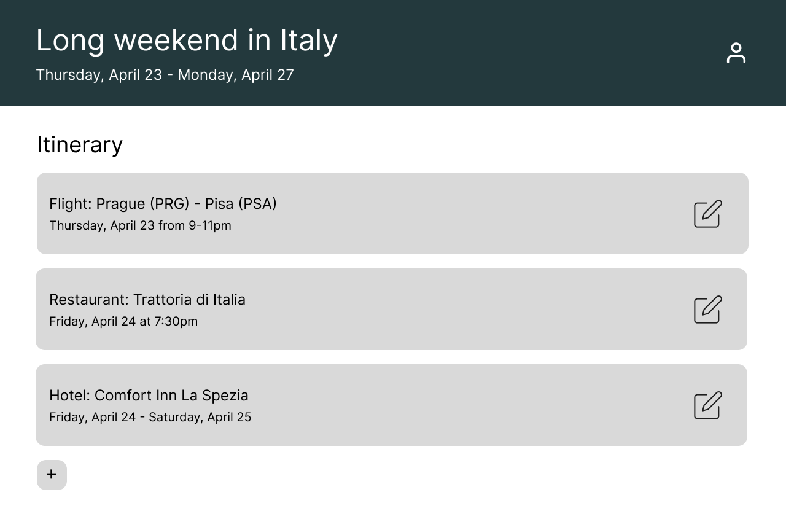
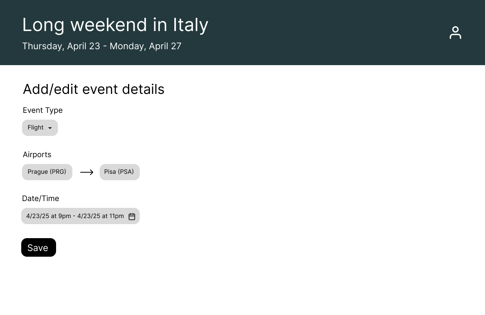

# Wireframes
## Signup
Users can sign up for the app using their email and password, and an account will be created for them. 

## Login
Users can log in using their email and password. 

## Trips
Upon logging in, users can view a list of trips they have created with some basic surface info included.

## Itinerary
Once a user clicks on their desired trip, it'll bring them to an itinerary screen that shows all events in that trip in chronological order.

## Event Edit
Users can add or edit an event in their itinerary.
